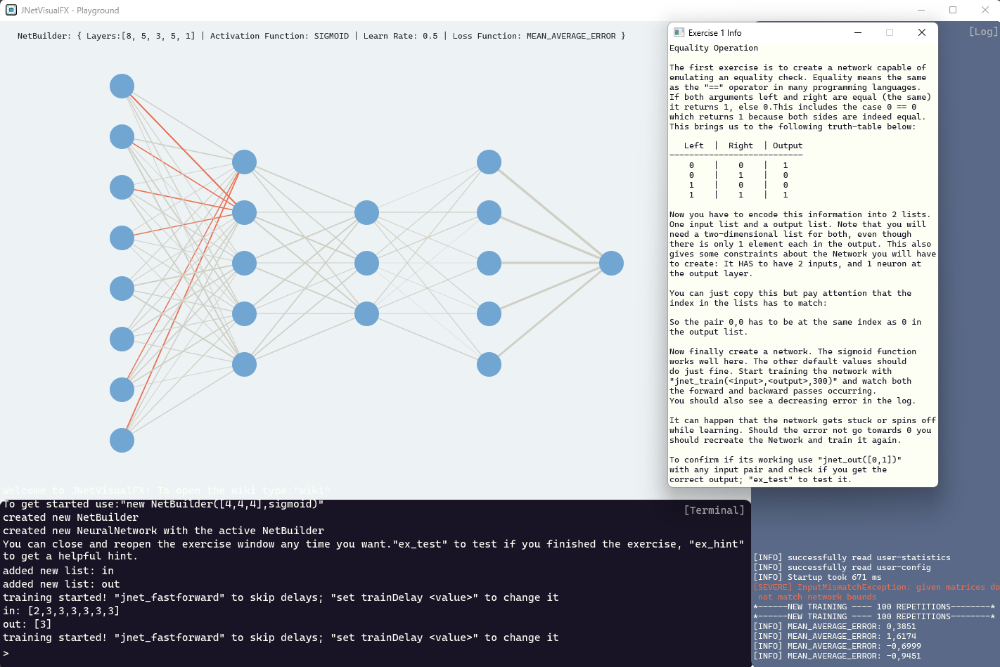

### JNetVisualFX

JNetVisualFX is a terminal based NeuralNetwork visualizer with the focus on testing, training and playing around with *Neural Networks*. In the end its also meant as an educational application.

<!--suppress CheckImageSize -->

## For a comprehensive guide check [Wiki!](https://github.com/gk646/JNetVisualFX/wiki/Home/)

### *Disclaimer*
Iam in no way an expert on machine learning or neural networks. All information provided or gained through using JNetVisualFX is not guaranteed to be right nor do I guarantee it. I try to do my best to make an interesting application and learn about these topics myself by implementing them.

### **How to Install**

**Windows**  
The application comes already prepackaged in a .zip-archive with a runtime included. Just unzip it and start `JNetVisualFX.exe`.  

**Unix**  
Downlaod the v.x.x.x-LINUX.jar and run it. **You will need a basic Java Runtime installed**.  

### **How to get started:**

Upon starting, you won't have a built network yet. For building your first Network you need a NetBuilder, which is a reusable building block for your network.    
Create a new NetBuilder with `new NetBuilder([4,4,4],sigmoid)`, the first argument being a list of numbers representing the neuronCount each layer. Second is a activationFunction.
You can customize your NetBuilder with further commands to your liking.  
When you have your desired NetBuilder call `new Network` to create a new Network with your NetBuilder.  
Voilà, you made your first Network now you can play around with it!

### **Terminal**

The terminal is the central part of JNetVisualFX allowing you to get information, customize the application and interact with networks.  
It supports:
- Adding and deleting characters
- Scrolling through past commands using UP and DOWN (if there's no autocompletion)
- changing cursor position with LEFT and RIGHT  
- Code completion with TAB (if there's only 1 suggestion)
- Pasting text from the clipboard
- Parsing of arithmetic expressions from the command line e.g `2+3`
- Printing variables (lists) with `$<var-name>` 

There's lots of useful commands but these here will get you started:
- `help` - displays helpful information 
- `helpall` - lists all commands in the log
- `man` - used as prefix for methods to display their manual page e.g. `man print`

Feel free to experiment around there's a lot of small commands to explore.

